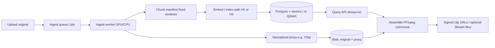

# Video Highlighter — Architecture Overview

- **Status:** Living draft (stack unlocked)
- **Date:** 2026-10-01
- **Deciders:** Architect (draft); Leo to confirm after bake-off
- **Grounding:** `/workspace/video-highlighter-research-brief.md`; product ideation from [llevintza/video-highlighter](https://github.com/llevintza/video-highlighter) README (hypothesis only)

> **Stack is not locked.** Tables and diagrams below describe a **coherent MVP experiment starting point**. Every layer has named alternatives in the ADRs. Confirm with a short bake-off on real youth/HS/club footage before treating any choice as Accepted.

---

## Context and goals

Leo’s product targets **youth / high-school / club basketball** game recordings—typically ~1–2 hours of sideline/phone camera video. Stakeholders are parents, coaches, and players who want personalized highlight reels from a **shared index** of the same game.

### Architectural thesis

| Phase | Character | Cost profile |
|-------|-----------|--------------|
| **Ingest (once per game)** | Heavy, bursty, GPU-friendly | Pay once: chunk → multimodal embed → vector + metadata index |
| **Query (many times)** | Cheap, always-on | NL / player / play-type filters → timestamps + signed clip URLs; assemble without re-analyzing content |

**Success gate for the MVP experiment:** On one real game, a parent-style query (e.g. “show #12 defense in the second half”) returns useful clips in **&lt;5 seconds** from the index **without** re-sending the full video through an LLM.

### Scale assumptions (from the brief; adjust when Leo has real numbers)

| Assumption | Value |
|---|---|
| Games initially | tens → low hundreds |
| Duration / game | ~90–120 minutes |
| Raw file size / game | ~2–8 GB (1080p phone/sideline; highly variable) |
| Chunks / game | ~500–3,000 |
| Query pattern | bursty after games; many parents/coaches on a shared index |
| Clip delivery | short reels (1–10 min) streamed or downloaded to phones |

### Privacy posture

Family and youth athlete video. Prefer **portable authoritative originals** (NAS / R2 / B2 you control). **Defer face biometrics for minors.** Player identity for MVP = roster + **manual tags**; jersey OCR is best-effort metadata with confidence only.

---

## Logical flow



Planes are **logically separate** even if co-located on one box at first:

- **Ingest plane** — heavy, bursty, scale-to-zero GPU workers; writes blobs + index.
- **Query plane** — small always-on API; reads index; returns ranges + triggers lightweight assemble.

---

## Options considered → recommendation (experiment) → rationale

The README’s “Suggested Tech Stack” (FFmpeg, PySceneDetect, CLIP-family / TwelveLabs / InternVideo2, Qdrant/Weaviate/Pinecone/Milvus/FAISS, FastAPI, S3, Next.js) is **hypothesis only**. The research brief evaluated alternatives with evidence. Summary:

| Layer | Options considered (named) | MVP experiment starting point | Why (revisitable) |
|-------|----------------------------|-------------------------------|-------------------|
| Ingest / chunk | FFmpeg ± PySceneDetect; Mux / Cloudflare Stream; MediaConvert; Shotstack (export only); cloud label APIs as enrichment | **FFmpeg** proxy + **fixed ~4–8 s** chunks (± optional AdaptiveDetector merge) | Own timestamps; pure scene-detect is weak on continuous games — see [ADR-0001](./adrs/0001-ingest-and-chunking.md) |
| Understanding | TwelveLabs; GCP/Azure/AWS video APIs; Gemini/LLM captions at ingest; SigLIP2 / InternVideo2 / OpenCLIP | **Bake-off H1 vs H2** (TwelveLabs Search vs owned embeddings + batch captions) | Measure on *your* footage — see [ADR-0002](./adrs/0002-moment-detection-and-embeddings.md) |
| Player ID | Jersey OCR; team color+number; face ReID; MOT+ReID; **manual roster tags** | Roster + **manual tags** first; OCR best-effort | Minors + amateur angles; no face biometrics for MVP |
| Vector + metadata | pgvector; Qdrant; Weaviate; Pinecone; Milvus/Zilliz; FAISS/LanceDB/Chroma | **Postgres + pgvector** (or **Qdrant** if filters hurt) | Right early scale; OSS exit — see [ADR-0003](./adrs/0003-vector-and-metadata-store.md) |
| Blobs | R2; B2; Wasabi; S3 / GCS / Azure; local NAS | **R2 or B2** for remote; **NAS** OK for family-only | Egress-sensitive parent delivery — see [ADR-0004](./adrs/0004-blob-storage.md) |
| Runtime | Home GPU; VPS + Modal/RunPod/Vast; hyperscaler batch; Mux/Stream-centric | **Queue + GPU worker** + **tiny always-on API** | Separate cost profiles — see [ADR-0005](./adrs/0005-runtime-and-hosting.md) |
| Assemble | FFmpeg cut/concat; Mux/Stream clip APIs; Shotstack polish | FFmpeg → signed URL; defer Shotstack | Avoid $/output-minute until branding needs it |
| Frontend | Full Next.js app vs CLI / timestamp JSON | **Deferred** | README already deprioritizes UI; prove the gate first |

**Cost intuition (illustrative, brief ~2026-10-01):** TwelveLabs Developer Search indexing ~$2.50/hour indexed (~$4.17 for a 100-min game) + ~$0.09/hour/month infra; cloud label stacks can hit ~$0.35+/min; home/DIY GPU ingest is near-zero marginal $; R2 storage ~$0.015/GB-month with free egress; parent streaming egress on S3-class can dominate. Re-verify vendor pages before budgeting.

---

## Component responsibilities

| Component | Plane | Responsibility |
|-----------|-------|----------------|
| **Upload intake** | Edge / API | Accept multi-GB originals; checksum; enqueue ingest job; never block UI on full embed |
| **Ingest worker** | Ingest | Probe/normalize with FFmpeg; write proxy; emit chunk manifest with absolute timestamps; run embed/caption/OCR paths; write vectors + metadata; mark job complete/failed |
| **Blob store** | Shared | Authoritative original + proxy; optional cached highlight MP4s; portable off vendor players |
| **Index store** | Shared | Hybrid ANN + SQL/payload filters on game, player, play type, period, confidence, model version |
| **Query API** | Query | Auth (family-scoped later); embed/query text or structured filters; return ranked `(game_id, start_ms, end_ms)` + assemble ticket; **no** full-video LLM round-trip |
| **Assemble worker** | Query (light) | FFmpeg cut/concat from proxy or original; keyframe tradeoffs; cache popular reels; signed URLs |
| **Roster / tags UI (minimal)** | Human-in-loop | CSV/API roster; confirm/correct player and play tags on key clips |

---

## Data model sketch (illustrative — not prescribed)

These entities are a **sketch** for conversation with the Tech Writer’s PRD; schemas will evolve after bake-off.

```text
games(
  id, title, played_at, team_home, team_away,
  original_blob_uri, proxy_blob_uri, duration_ms,
  ingest_status, model_bundle_version, created_at
)

chunks(
  id, game_id, start_ms, end_ms,
  embedding,                    -- or external vector id
  play_types[],                 -- proposed + human-corrected
  player_numbers[],             -- OCR guesses and/or manual
  ocr_text, caption_text,
  confidence, model_version,
  source_path                   -- H1 vendor id vs H2 local
)

roster_players(
  id, game_id or season_id,
  jersey_number, display_name, team_side
)

tags(                           -- human corrections / overrides
  id, chunk_id or range_ref,
  tag_kind,                     -- player | play_type | note
  value, tagged_by, created_at
)

jobs(
  id, kind,                     -- ingest | embed | assemble | reindex
  game_id, status, payload_json,
  attempts, last_error, created_at, finished_at
)

exports(                        -- optional cache of assembled reels
  id, query_fingerprint, blob_uri,
  ranges_json, expires_at
)
```

**Clip strategy:** Prefer storing **original + proxy** and generating/caching clips **on demand** over materializing every combinatorial reel.

---

## Query path latency budget (toward &lt;5 s gate)

Budget is for **index → useful clip list** (and optionally kick off assemble). Full re-encode of a long reel may take longer and should be asynchronous if needed; the gate is **useful clips from the index without re-LLM’ing the full game**.

| Step | Target (p95 stretch) | Notes |
|------|----------------------|-------|
| Auth + parse query | &lt;50 ms | Structured filters and/or short text |
| Query embedding (if NL) | &lt;100–300 ms | Small text embed; **not** video |
| Hybrid ANN + filters | &lt;200–500 ms | pgvector or Qdrant at ~10k–1M vectors |
| Rank / diversify / merge adjacent chunks | &lt;100 ms | Collapse neighboring windows |
| Resolve signed URLs or assemble ticket | &lt;200–500 ms | Pre-signed GETs; optional async FFmpeg |
| **Total to “useful clip list”** | **&lt;5 s** (aim ≪5 s) | Success gate |

**Anti-pattern:** Sending the full 1–2 h video (or all chunks) through Gemini/OpenAI at query time. Generative video understanding belongs on the **ingest** path only (batch captions/tags).

---

## Non-goals for MVP experiment

- Full polished parent UI / Next.js product surface (CLI or timestamp JSON is enough to prove the thesis)
- Face biometrics / face ReID for minors
- Multi-tenant club SaaS scale, billing, or org IAM
- Shotstack-grade branded edits on every reel
- Broadcast-quality auto-highlight parity with Hudl / Pixellot / WSC (those systems assume better cameras and often human tagging)
- Always-on cloud GPU
- Pre-rendering every possible parent reel
- Treating MediaConvert + multi-CDN ABR as day-one requirement
- Locking to any single vendor’s clip IDs as the only portable truth

---

## Bake-off plan (TwelveLabs H1 vs owned H2)

Run on **2–3 real games** (ideally Leo’s footage), same prompts, same human judgments.

### Path H1 — speed / managed index

1. Index full games with **TwelveLabs** Search (sports vertical noted by vendor).
2. Measure recall/precision for prompts like “steals”, “three-pointers”, “#12 layup” on *amateur* angles.
3. Track Developer-plan costs: indexing ~**$2.50 / hour** one-time + infra ~**$0.09 / hour / month** indexed + search ~**$4 / 1k queries** (~2026-10-01 list). Illustrative: 100-min game ≈ $4.17 index + ~$0.15/mo infra.
4. Verify Embed API export/retention if you need durable self-hosted vectors later.

### Path H2 — owned index

1. FFmpeg chunks → **SigLIP2** (or **InternVideo2** if VRAM allows) embeddings into your vector store.
2. Batch **Gemini Flash** (or similar) at ingest for play-type proposals + jersey guesses → metadata.
3. Human correct once via roster tags.
4. Optional: cloud Video Intelligence / Rekognition / Azure Video Indexer **only** as OCR/shot helpers — watch stacked **$/min** (e.g. GCP label+OCR+person ≈ **$0.35+/min** → ~$35+ per 100-min game after free tier; ~2026-10-01).

### Decision rule

Pick H1, H2, or a hybrid **after** measuring HS/club footage quality, monthly infra gravity, and Leo’s preference for model ownership vs DIY GPU time. Do **not** assume CLIP alone solves basketball semantics; do **not** assume NBA-trained models transfer to phone video without evaluation.

---

## Consequences of the experiment posture

**Positive**

- Preserves “query forever without reprocess” if we own timestamps and can re-embed.
- Separates expensive GPU bursts from cheap query SLA.
- Keeps privacy and portability of youth athlete originals front-and-center.
- Avoids combinatorial clip storage.

**Tradeoffs / risks**

- Amateur footage will degrade jersey OCR and play detection vs broadcast systems — plan human-in-the-loop early.
- TwelveLabs path is fast but adds vendor gravity and monthly infra while indexed.
- Owned path needs GPU ops and labeling discipline.
- Keyframe-snapped cuts (~±1–2 s) may be “good enough” vs frame-accurate re-encode cost.

---

## Open questions rolled up for Leo

Prioritized from the research brief:

1. **Footage access** — Can Architect get 1–2 full representative games (length, resolution, angle) under private access for bake-offs?
2. **Budget ceiling** — Soft monthly cap for AI + hosting in season 1 (~$20 vs ~$200 vs ~$2,000)?
3. **Player ID bar** — Is manual tagging OK for v0 (“my kid” via roster confirm)?
4. **Delivery UX** — Stream-in-browser day 1 vs downloadable MP4 / timestamp list?
5. **Privacy** — Confirm face biometrics off-limits; any school/club rules or data residency for minor athlete video?
6. **Taxonomy** — Who defines play types; any existing Hudl/stat tags to import?
7. **Multi-tenant timeline** — Family-only vs whole club this season?
8. **Model ownership** — Comfort with TwelveLabs lock-in vs DIY GPU time?
9. **Source format** — Phone vs camcorder; 1080p60 vs 4K; average GB/game?
10. **Clip accuracy** — Keyframe-snapped vs frame-accurate re-encode acceptable?
11. **Retention** — Keep every game forever, or rolling N seasons?
12. **Upload path** — Parent phone from gym Wi-Fi vs home after game? Local NVIDIA GPU available overnight?

---

## References

- Research brief: `/workspace/video-highlighter-research-brief.md`
- ADRs: [adrs/README.md](./adrs/README.md)
- Product ideation: [github.com/llevintza/video-highlighter](https://github.com/llevintza/video-highlighter)
- Vendor pricing / docs cited in ADRs (snapshots ~2026-10-01)

*PRD (`prd.md`) is owned by Tech Writer and may arrive later.*
